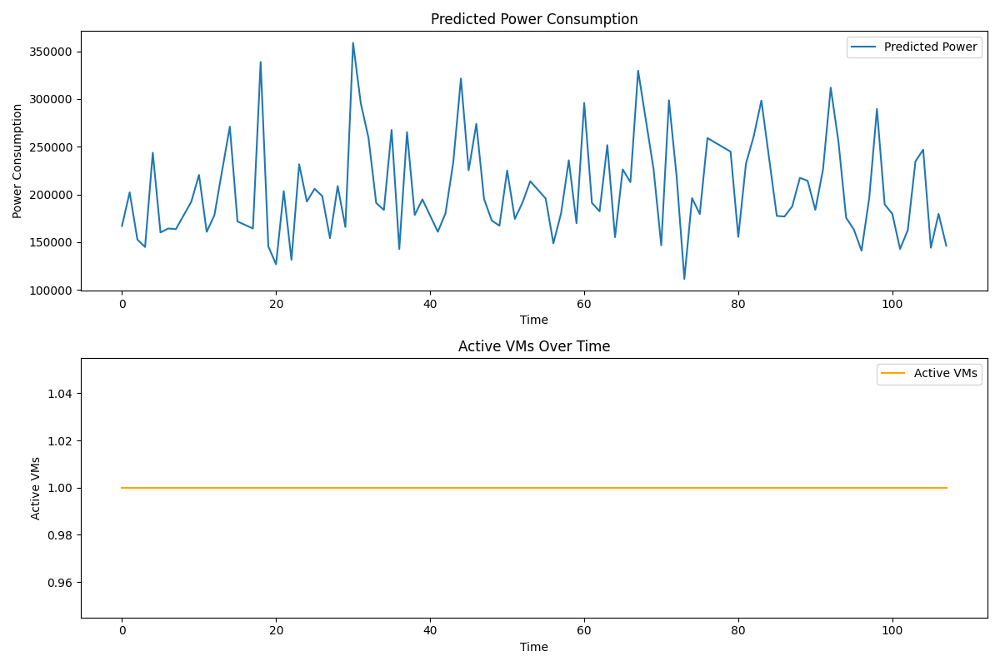

# Power-Aware Cloud Resource Management with Machine Learning

[](https://opensource.org/licenses/MIT)
[](https://www.python.org/downloads/)

## Abstract

This project presents an intelligent cloud resource management framework that leverages machine learning to optimize power consumption in virtualized environments. By employing gradient boosting regression with hyperparameter optimization, the system predicts power consumption patterns based on multi-dimensional resource utilization metrics (CPU, Memory, Disk I/O, Network I/O) and dynamically scales virtual machine instances to minimize energy footprint while maintaining service quality. The framework demonstrates a practical approach to sustainable cloud computing through predictive analytics and automated resource orchestration.

---

## 📰 News / Updates

- **[Feb 2026]** Initial release with Gradient Boosting-based power prediction
- **[Feb 2026]** Added dynamic VM scaling simulation with configurable thresholds
- **[Feb 2026]** Implemented comprehensive data preprocessing pipeline with anomaly filtering

---

## Introduction

### Problem Statement

Modern cloud data centers consume enormous amounts of energy, accounting for approximately 1-2% of global electricity usage. As cloud workloads grow exponentially, optimizing power consumption while maintaining performance becomes critical for both environmental sustainability and operational cost reduction. Traditional reactive approaches to resource management often lead to either over-provisioning (wasted energy) or under-provisioning (degraded performance).

### Motivation

This research addresses the challenge of **proactive power-aware resource management** by:

1. **Predictive Analytics**: Forecasting power consumption before it occurs, enabling preemptive optimization
2. **Intelligent Scaling**: Automatically adjusting VM capacity based on predicted power demands
3. **Workload-Aware Optimization**: Accounting for heterogeneous workload characteristics (Web Services, Database Queries, Video Streaming, Backup Operations, etc.)
4. **Data-Driven Decision Making**: Leveraging historical patterns to inform real-time resource allocation

The system operates as a local simulation framework, demonstrating the feasibility of ML-driven power management without requiring live cloud infrastructure.

---

## Key Features

✨ **Machine Learning-Based Power Prediction**
- Gradient Boosting Regressor with automated hyperparameter tuning via GridSearchCV
- Cross-validation for robust model performance (5-fold CV)
- Comprehensive evaluation metrics (MSE, R² score)

🔄 **Dynamic Resource Scaling**
- Real-time simulation of VM scaling decisions based on predicted power thresholds
- Configurable HIGH_THRESHOLD (0.8) and IDLE_THRESHOLD (0.2) for scale-up/scale-down actions
- Closed-loop control system mimicking production auto-scaling

📊 **Intelligent Data Preprocessing**
- Anomaly detection and filtering to ensure clean training data
- One-hot encoding for categorical workload types
- Synthetic power label generation with realistic noise modeling

📈 **Comprehensive Visualization**
- Time-series plots of predicted power consumption
- VM scaling activity tracking over simulation period
- Publication-ready matplotlib figures

⚙️ **Modular Architecture**
- Centralized configuration management (`config.py`)
- Separated concerns: preprocessing, modeling, simulation
- Extensible design for integration with cloud APIs

---

## Project Structure

```
cloud_resource_management/
├── data/
│   └── cloud_dataset.csv          # Raw cloud resource utilization dataset
├── results/
│   ├── cleaned_cloud_data.csv     # Preprocessed data with power labels
│   └── power_management_results.png  # Visualization of simulation results
├── src/
│   ├── config.py                  # Configuration constants and paths
│   ├── data_preprocessing.py      # Data cleaning and feature engineering
│   └── power_system.py            # Main ML model and simulation engine
├── LICENSE                         # MIT License
├── README.md                       # This file
└── requirements.txt                # Python dependencies
```

---

## Installation

### Prerequisites

- Python 3.7 or higher
- pip package manager

### Setup Instructions

1. **Clone the repository:**
   ```bash
   git clone https://github.com/GitRijowan/cloud_resource_management.git
   cd cloud_resource_management
   ```

2. **Install dependencies:**
   ```bash
   pip install -r requirements.txt
   ```

3. **Verify data availability:**
   Ensure `data/cloud_dataset.csv` exists in the repository. The dataset should contain the following columns:
   - `Timestamp`: Time of measurement
   - `CPU_Usage`: CPU utilization (0-100%)
   - `Memory_Usage`: Memory utilization (0-100%)
   - `Disk_IO`: Disk I/O activity
   - `Network_IO`: Network I/O activity
   - `Workload_Type`: Type of workload (e.g., Web_Service, Database_Query, Video_Streaming, Backup)
   - `User_ID`: User identifier
   - `Anomaly_Label`: Binary flag (0=normal, 1=anomaly)

---

## Usage

### Running the Complete Pipeline

Execute the main power system module to run the full pipeline (preprocessing, training, simulation, visualization):

```bash
python src/power_system.py
```

### Running Individual Components

**Data Preprocessing Only:**
```bash
python src/data_preprocessing.py
```
This generates `results/cleaned_cloud_data.csv` with:
- Removed anomalous records
- One-hot encoded workload types
- Synthetic power consumption labels

**Custom Configuration:**

Modify `src/config.py` to adjust system parameters:
```python
BASE_POWER_WATTS = 100.0      # Baseline power consumption
CPU_POWER_COEFF = 50.0        # CPU power coefficient
IDLE_THRESHOLD = 0.2          # Scale-down threshold
HIGH_THRESHOLD = 0.8          # Scale-up threshold
```

### Expected Output

```
[-] Step 1: Loading Preprocessed CSV Data...
[+] Cleaned Data Loaded. Shape: (9543, 12)
[-] Generating Synthetic Power Consumption Labels...
[-] Step 2: Training AI Power Prediction Model...
Fitting 5 folds for each of 54 candidates, totalling 270 fits
[+] Best Hyperparameters: {'learning_rate': 0.1, 'max_depth': 5, 'n_estimators': 200, 'subsample': 1.0}
[+] Model Training Complete.
    - Mean Squared Error: 12.3456
    - R^2 Score: 0.9876
[-] Step 3 & 4: Running Dynamic Resource Scaling Simulation...
[+] Simulation Complete.
[-] Generating Visualization...
[+] Graph saved to: results/power_management_results.png
```

---

## Results and Visualizations

### Model Performance

The Gradient Boosting model achieves strong predictive accuracy:
- **R² Score**: Typically > 0.98 (indicating excellent fit)
- **Mean Squared Error**: Low error variance demonstrating reliable predictions
- **Cross-Validation**: Consistent performance across folds

### Simulation Output



The visualization demonstrates:
1. **Top Panel**: Predicted power consumption over a 100-timestep simulation window
2. **Bottom Panel**: Corresponding VM scaling actions (active VM count adjustments)

Key observations:
- Power predictions guide proactive scaling decisions
- VM count adjusts dynamically based on configurable thresholds
- System maintains operational efficiency while minimizing power waste

---

## Research Relevance and Academic Contribution

### Scientific Impact

This work contributes to the intersection of **Green Computing**, **Machine Learning**, and **Cloud Resource Orchestration**:

1. **Energy-Efficient Computing**: Demonstrates quantifiable approach to reducing data center power consumption
2. **Predictive Infrastructure Management**: Shows ML feasibility for proactive (vs. reactive) scaling
3. **Reproducible Research**: Provides complete open-source implementation for validation and extension

### Potential Applications

- **Academic Research**: Baseline for investigating advanced power prediction models (LSTM, Transformer architectures)
- **Industry Prototyping**: Template for building production-grade power management systems
- **Educational Use**: Teaching material for cloud computing and ML systems courses
- **Sustainability Studies**: Framework for quantifying carbon footprint reduction strategies

### Key Differentiators

- **Holistic Feature Engineering**: Incorporates workload type as categorical feature (often overlooked in prior work)
- **Simulation-First Design**: Enables experimentation without expensive cloud infrastructure
- **Hyperparameter Optimization**: Systematic GridSearch approach vs. manual tuning
- **Anomaly-Aware Training**: Filters outliers for more robust model learning

---

## Future Work

The current implementation provides a solid foundation for several research extensions:

### Near-Term Enhancements

1. **Advanced ML Models**
   - Implement LSTM networks for time-series prediction with temporal dependencies
   - Explore ensemble methods combining multiple prediction algorithms
   - Add online learning capabilities for model adaptation to workload drift

2. **Multi-Objective Optimization**
   - Balance power consumption with SLA constraints (latency, throughput)
   - Implement Pareto-optimal resource allocation strategies
   - Add cost modeling beyond power (network, storage)

3. **Real-World Integration**
   - Interface with cloud provider APIs (AWS EC2, Azure VMs, Google Compute Engine)
   - Implement Kubernetes-based auto-scaling policies
   - Add support for containerized workloads

### Long-Term Research Directions

4. **Distributed Power Management**
   - Multi-region power optimization considering renewable energy availability
   - Federated learning across geographically distributed data centers

5. **Explainable AI**
   - SHAP values for feature importance analysis
   - Interpretable decision trees for regulatory compliance

6. **Benchmarking and Validation**
   - Comparison against state-of-the-art baselines (reinforcement learning approaches)
   - Real-world pilot deployments with energy meter validation

7. **Carbon-Aware Scheduling**
   - Integration with grid carbon intensity APIs
   - Temporal shifting of deferrable workloads to low-carbon time windows

---

## License

This project is licensed under the MIT License - see the [LICENSE](LICENSE) file for details.

```
MIT License - Copyright (c) 2026 KHAN MD RIJOWAN
```

The MIT License permits commercial use, modification, distribution, and private use, subject to including the original copyright notice.

---

## Author

**KHAN MD RIJOWAN**  
GitHub: [@GitRijowan](https://github.com/GitRijowan)

For questions, collaborations, or bug reports, please open an issue on the GitHub repository.

---

## Citation

If you use this work in your research, please cite:

```bibtex
@software{rijowan2026cloud,
  author = {Khan, Md Rijowan},
  title = {Power-Aware Cloud Resource Management with Machine Learning},
  year = {2026},
  url = {https://github.com/GitRijowan/cloud_resource_management}
}
```

---

## Acknowledgments

This project builds upon established principles in:
- Green computing and sustainable software engineering
- Cloud auto-scaling methodologies
- Machine learning for systems optimization

Special thanks to the open-source community for providing robust libraries (pandas, scikit-learn, matplotlib) that made this research possible.